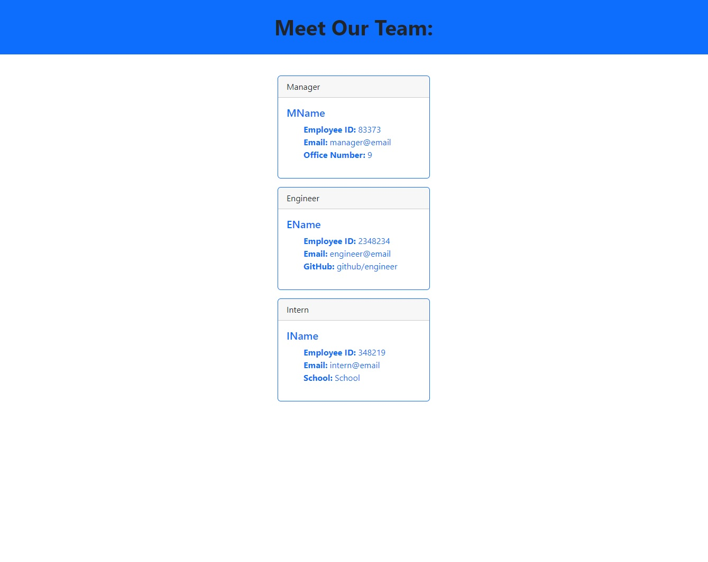

# Team Profile Generator

A command-line application that allows the user to input data for different members of a team. The application then renders a team profile as an HTML file, with cards displaying each team member's information.

[Demo Video](https://drive.google.com/file/d/1KVPN-dhUeI5362t0MO-69nhoPPCrZTex/view?usp=sharing)

This application uses:  
[Node](https://nodejs.org/en/)  
[Inquirer](https://www.npmjs.com/package/inquirer)  
[Jest](https://jestjs.io/)  
[Bootstrap](https://getbootstrap.com/)
